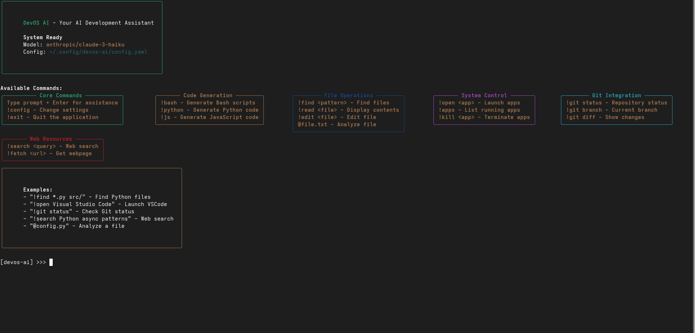

# DevOS AI - Your AI-Powered Development Assistant

DevOS AI is an intelligent terminal and web-based assistant that helps developers automate tasks, generate code, diagnose errors, and manage projects directly from their workflow.



## 🌟 Features

- **AI-Powered Terminal**: Natural language interface for development tasks
- **Smart Automation**: Execute predefined workflows with single commands
- **Code Generation**: Generate boilerplate code in multiple languages
- **Error Diagnosis**: Get intelligent solutions for error messages
- **Project Control**: Manage files, apps, and Git repositories
- **Web Integration**: Search and fetch technical resources

## 🛠 Installation

### Prerequisites
- Python 3.8+
- Node.js 16+ (for web interface)
- Git

### CLI Installation
```bash
# Clone the repository
git clone https://github.com/yourusername/devos-ai.git
cd devos-ai/cli

# Install dependencies
pip install -r requirements.txt

# Install in development mode
pip install -e .

# Set up environment variables
cp .env.example .env
```
### Optional Backend Setup
```bash
cd ../server
npm install
```

## ⚙️ Configuration

1. Get your OpenRouter API key from [OpenRouter](https://openrouter.ai/)
2. Add it to `.env`:
   ```env
   OPENROUTER_API_KEY=your_api_key_here
   ```

## 🚀 Usage

### CLI Mode
```bash
# Start interactive chat
devos-ai chat

# Run specific commands
python -m main chat

devos-ai find-files "*.py" src/
devos-ai open-app "Visual Studio Code"
```

### Available Commands

| Command               | Description                                  | Example                          |
|-----------------------|----------------------------------------------|----------------------------------|
| `!bash`               | Generate bash scripts                        | `!bash backup script`            |
| `!python`             | Generate Python code                         | `!python Flask REST API`         |
| `!git <cmd>`          | Git operations                               | `!git status`                    |
| `!open <app>`         | Launch applications                          | `!open Chrome`                   |
| `!find <pattern>`     | Search files                                 | `!find *.py src/`                |
| `!search <query>`     | Web search                                   | `!search Python async patterns`  |
| `!workflow <name>`    | Run automation workflows                     | `!workflow python_setup`         |
| `!diagnose <error>`   | Get error solutions                          | `!diagnose ImportError`          |
| `!generate <type>`    | Code generation                              | `!generate python class`         |

## 📊 Available Executors

| Executor | Actions                          | Example Params                 |
|----------|----------------------------------|--------------------------------|
| `file`   | create, read, delete, find       | `path: "src/main.py"`          |
| `git`    | clone, commit, push, status      | `repo: "https://github.com/..."`|
| `shell`  | run_command                      | `command: "ls -la"`            |
| `api`    | get, post                        | `url: "https://api.example.com"`|


## 🛡️ Security Considerations

1. Always keep your API keys secure
2. Review workflows before execution
3. Use `--dry-run` flag for testing workflows
4. Set appropriate file permissions

## 📈 Roadmap

- [ ] VS Code Extension
- [ ] Team Collaboration Features
- [ ] Advanced CI/CD Integration
- [ ] Plugin System for Extensibility

## 🤝 Contributing

1. Fork the repository
2. Create your feature branch (`git checkout -b feature/AmazingFeature`)
3. Commit your changes (`git commit -m 'Add some AmazingFeature'`)
4. Push to the branch (`git push origin feature/AmazingFeature`)
5. Open a Pull Request

## 📜 License

Distributed under the MIT License. See `LICENSE` for more information.
